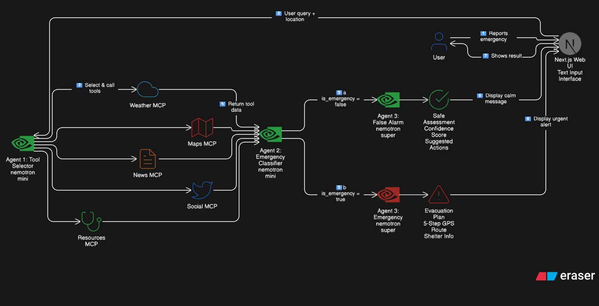

# CrisisVision

[](https://github.com/aldridge-fonseca/Nvidia-Hackathon/actions/workflows/ci.yml)

Multi-agent emergency response system powered by NVIDIA NIM for intelligent crisis management and evacuation coordination.

## Overview

CrisisVision uses AI agents to analyze emergency situations, determine false alarms from real threats, and provide coordinated evacuation guidance when needed. The system combines weather data, maps, news reports, social media, and emergency resources to make informed decisions.

## Screenshots

### 1. Main Page


Landing page with scenario selection

### 2-4. False Alarm Scenario


User reports smoke detector - system begins analysis


AI agents gather intelligence from multiple sources


System determines it's a false alarm with evidence and provides reassurance

### 5-7. Real Emergency Scenario


Active emergency detected - showing evacuation route step 1


System detects real wildfire threat and analyzes situation


Complete 5-step evacuation plan with GPS coordinates and shelter information

## Architecture

CrisisVision uses a **three-agent AI architecture** powered by NVIDIA NIM:



Three-stage AI workflow: Tool Selection → Emergency Classification → Response Generation

### Architecture Flow

1️⃣ **User Input** - User reports emergency via Next.js web interface  
2️⃣ **Agent 1: Tool Selector** - NVIDIA Nemotron Mini selects relevant MCP tools (Weather, Maps, News, Social, Resources)  
3️⃣ **Data Collection** - Selected tools gather real-time intelligence  
4️⃣ **Agent 2: Emergency Classifier** - NVIDIA Nemotron Mini analyzes data and classifies: Emergency or False Alarm  
5️⃣ **Agent 3: Response Generator** - NVIDIA Nemotron Super generates appropriate response:

- **False Alarm Path**: Safe assessment with confidence score and suggested actions
- **Emergency Path**: 5-step evacuation plan with GPS coordinates and shelter info  
6️⃣ **Display Results** - User receives clear, actionable guidance

### Architecture Benefits

- **🎯 Smart Tool Selection**: Agent 1 intelligently chooses which data sources to query
- **⚡ Fast Classification**: Agent 2 quickly triages emergency vs false alarm
- **🧠 Powerful Response**: Agent 3 generates detailed, context-aware guidance
- **🔄 Flexible Architecture**: Each agent can be tuned independently
- **💰 Cost Efficient**: Uses smaller models for triage, large model only for final response

## Features

- **Three-Agent AI Architecture**: Smart tool selection, fast classification, and powerful response generation
- **Dynamic Text Input**: Users describe any emergency situation in natural language
- **Intelligent Analysis**: Differentiates false alarms from real emergencies using AI triage
- **Multi-Agent System**: Weather, maps, news, social media, and resource agents work in parallel
- **NVIDIA NIM Integration**: Powered by NVIDIA Nemotron Mini and Nemotron Super models
- **Real-Time Visualization**: See each agent execute and contribute intelligence
- **Emergency Procedures**: Built-in knowledge base for fire, hurricane, and flood protocols
- **Evacuation Planning**: GPS coordinates, routes, shelter locations, and resource allocation

## Tech Stack

### Backend

- **Python 3.11** with FastAPI
- **NVIDIA NIM API** for LLM intelligence
- **Docker Compose** for containerization
- **MCP Protocol** for agent communication
- **Async/await** for parallel processing

### Frontend

- **Next.js 14** with TypeScript
- **Tailwind CSS** for styling
- **Framer Motion** for animations
- **Lucide React** for icons

## Quick Start

### Prerequisites

- Docker and Docker Compose
- Node.js 18+ (for demo UI)
- NVIDIA NIM API key ([Get one here](https://build.nvidia.com/))

### Backend Setup

1. Navigate to backend folder:

```bash
cd backend
```

1. Create `.env` file:

```bash
cp .env.example .env
```

1. Add your NVIDIA API key to `.env`:

```bash
NVIDIA_API_KEY=your_key_here
```

1. Start services:

```bash
# Windows
.\start.ps1

# Linux/Mac
./start.sh
```

Backend runs at `http://localhost:8000`

### Frontend Setup

1. Navigate to demo-ui folder:

```bash
cd demo-ui
```

1. Install dependencies:

```bash
npm install
```

1. Start development server:

```bash
npm run dev
```

Frontend runs at `http://localhost:3000`

## API Documentation

Once the backend is running, visit:

- **Swagger UI**: <http://localhost:8000/docs>
- **ReDoc**: <http://localhost:8000/redoc>

### Key Endpoints

POST /analyze

```json
{
  "scenario": "fire",
  "user_input": "I smell smoke in my house",
  "location": "San Francisco, CA"
}
```

Response

```json
{
  "is_real_emergency": false,
  "confidence": 0.3,
  "reasoning": "Low risk assessment based on...",
  "recommendations": ["Check batteries", "Ventilate area"]
}
```

POST /evacuate

```json
{
  "emergency_type": "fire",
  "location": "San Francisco, CA",
  "user_input": "Wildfire approaching neighborhood"
}

## Project Structure

```text
Nvidia-Hackathon/
├── backend/
│   ├── orchestrator/           # Main coordination service
│   │   ├── main.py            # FastAPI app
│   │   ├── prompts.py         # LLM prompt templates
│   │   └── knowledge.py       # Emergency procedures
│   ├── mcp_servers/           # Microservices
│   │   ├── weather/           # Weather intelligence
│   │   ├── maps/              # Navigation & routing
│   │   ├── news/              # Official reports
│   │   ├── social/            # Social media analysis
│   │   └── resource/          # Emergency resources
│   ├── docker-compose.yml     # Container orchestration
│   └── README.md              # Backend documentation
├── demo-ui/                   # Next.js frontend
│   ├── app/                   # App router pages
│   └── components/            # React components
├── screenshots/               # Application screenshots
└── README.md                  # This file
```

## Testing

### Backend Tests

```bash
cd backend

# Test orchestrator
curl -X POST http://localhost:8000/analyze \
  -H "Content-Type: application/json" \
  -d '{"scenario":"fire","user_input":"smoke detector","location":"SF"}'

# Test individual agents
curl http://localhost:8001/weather?emergency_type=fire
curl http://localhost:8002/maps?emergency_type=fire
curl http://localhost:8003/news?emergency_type=fire
curl http://localhost:8004/social?emergency_type=fire
curl http://localhost:8005/resources?emergency_type=fire
```

### Frontend Tests

Open <http://localhost:3000> and test both scenarios:

1. False alarm (smoke detector)
2. Real emergency (wildfire)

## Emergency Types Supported

- **Fire**: Wildfires, building fires, smoke detection
- **Hurricane**: Tropical storms, high winds, coastal threats
- **Flood**: Heavy rainfall, flash floods, river overflow
- **None**: Default state for general queries

## Configuration

### Environment Variables

| Variable | Description | Required |
|----------|-------------|----------|
| `NVIDIA_API_KEY` | NVIDIA NIM API key | Yes |
| `NVIDIA_API_URL` | NIM API endpoint | No (has default) |
| `NVIDIA_MODEL` | LLM model to use | No (has default) |
| `LOG_LEVEL` | Logging level | No (default: INFO) |

### Agent Configuration

Each agent can be customized by editing its `server.py` file:

- Mock data for different emergency types
- Response formats
- Health check endpoints

## Docker Services

| Service | Port | Description |
|---------|------|-------------|
| orchestrator | 8000 | Main coordination API |
| weather-agent | 8001 | Weather intelligence |
| maps-agent | 8002 | Navigation & routing |
| news-agent | 8003 | Official reports |
| social-agent | 8004 | Social media analysis |
| resource-agent | 8005 | Emergency resources |

## Documentation

- **README.md** - This file (overview and quick start)
- **backend/LLM_PROMPTS.md** - Complete prompt documentation
- **backend/README.md** - Backend setup and API details
- **backend/IMPLEMENTATION.md** - Technical implementation details
- **backend/TESTING.md** - Complete testing guide
- **backend/FRONTEND_INTEGRATION.md** - UI integration guide

## Production Deployment

1. Set production environment variables
2. Build Docker images: `docker-compose build`
3. Deploy with: `docker-compose up -d`
4. Configure reverse proxy (nginx)
5. Enable HTTPS
6. Set up monitoring and logging

## License

MIT License - See LICENSE file for details

## Acknowledgments

Built with NVIDIA NIM for intelligent emergency response coordination.
